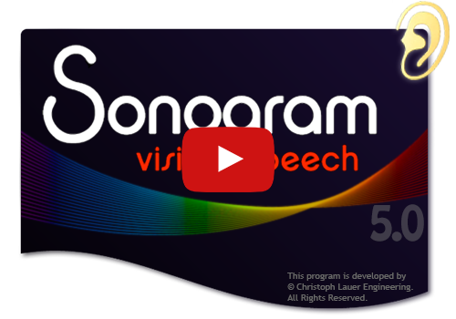
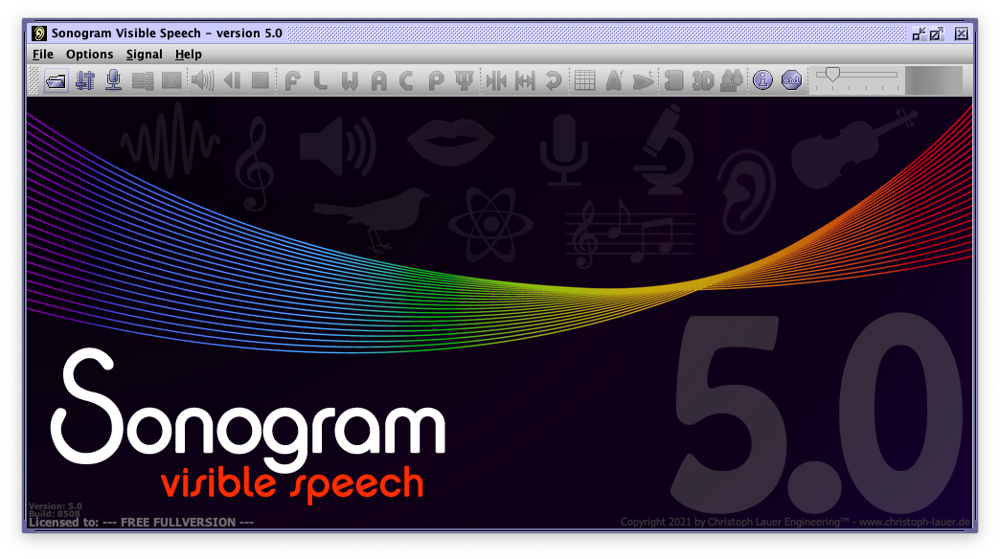
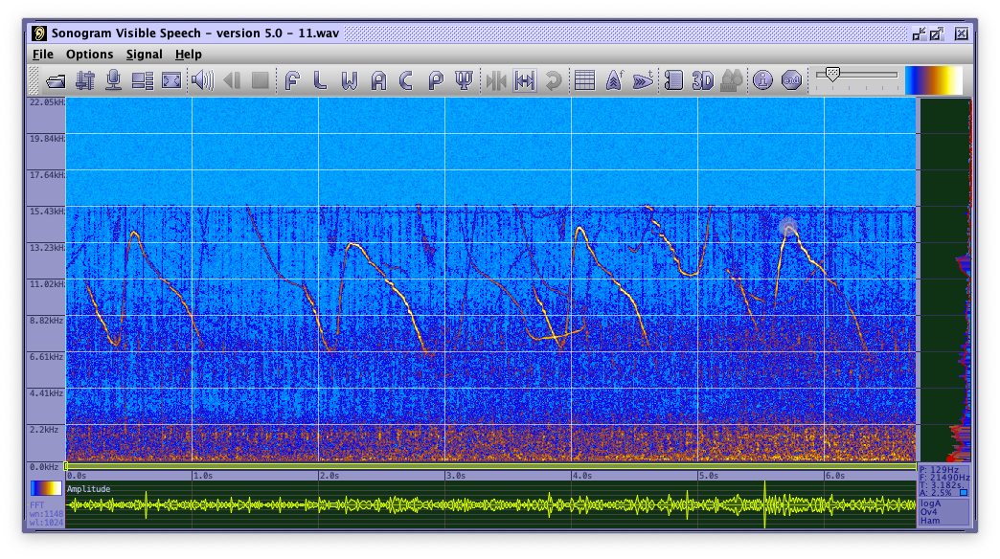
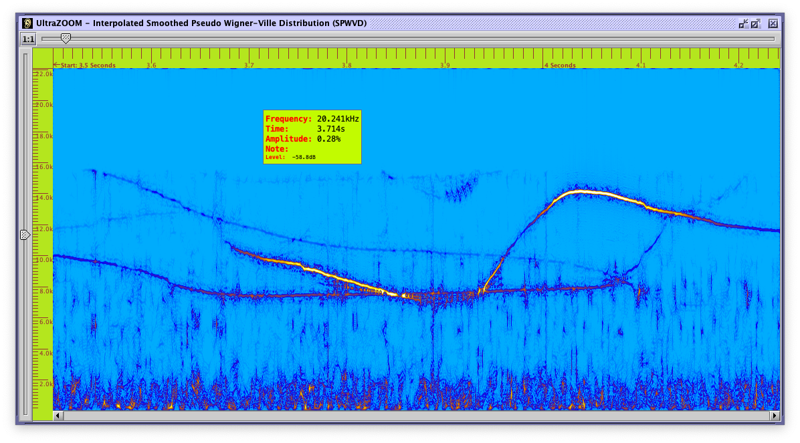
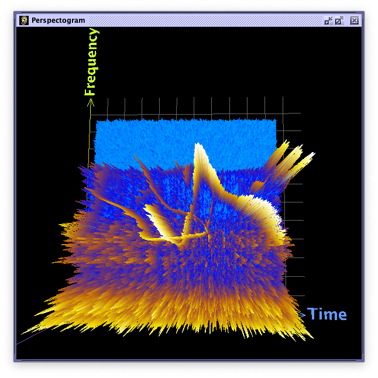
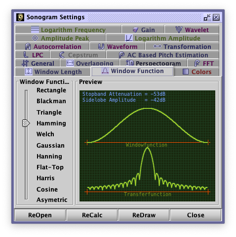
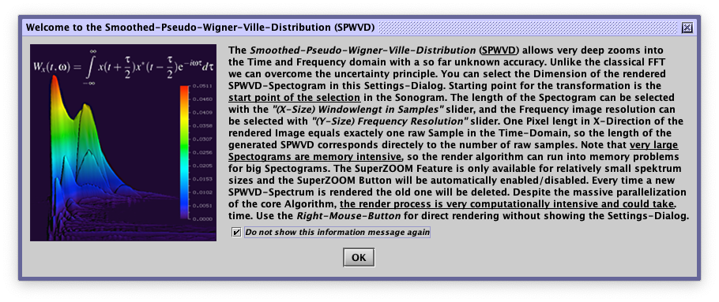
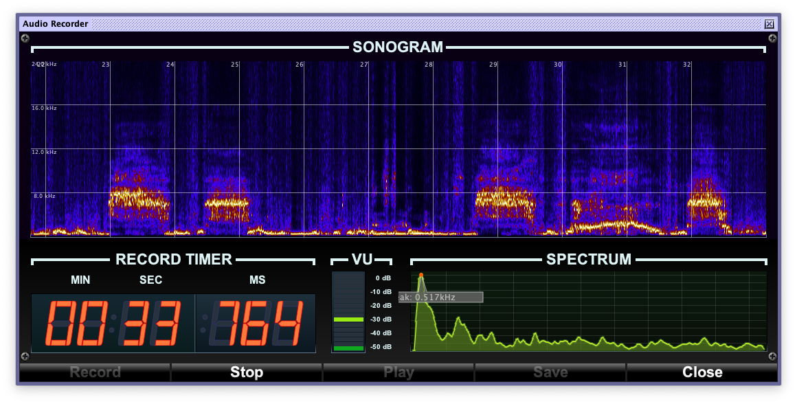
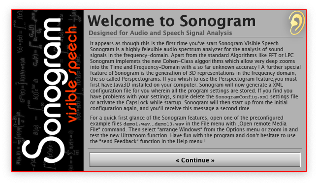
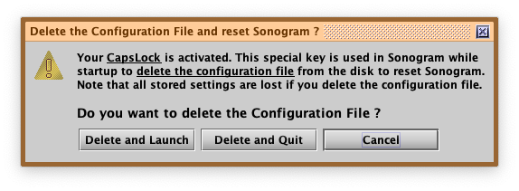

# Sonogram Visible Speech 5.0

Sonogram visible speech has been programmed at the German Research Center for Artifical Intelligence  (Deutsches Forschungszentrum fuer Kuenstliche Intelligenz DFKI, www.dfki.de), and is a 3D tool to analyze speech and sound signals with FFT and various other algorithms. The origin of the project was to build my own speech recognizer. The new version **requires Java at least in version 16**. **If you have any questions or problems running or compiling the Sonogram, don't hesitate to contact us.**

Contact: [Christoph Lauer](https://christoph-lauer.github.io), christophlauer@me.com 

## Download
**Note:** You have to be Java at least in version 16 installed on your Computer in order to use Sonogram. See [AdoptOpenJdk](https://adoptopenjdk.net) or [Oracle JDK](https://www.oracle.com/java/technologies/javase-jdk16-downloads.html). __Apple Silicon (ARM)__ users should use the native [Azul Zulu](https://www.azul.com/downloads/) JDK or JRE. 

* [Download](https://github.com/Christoph-Lauer/Sonogram/releases/download/v5.0/SonogramMacOS.zip) Sonogram for **macOS**
* [Download](https://github.com/Christoph-Lauer/Sonogram/releases/download/v5.0/SonogramWindows.zip) Sonogram for **Windows**
* [Download](https://github.com/Christoph-Lauer/Sonogram/releases/download/v5.0/SonogramUnix.zip) Sonogram for **Unix/linux**

 (Sonogram is free, but please support the further Development of Sonogram Visible Speech)

## Screenshots

## Support
If you have trouble with the Sonogram settings you can **start Sonogram with CAPS-LOCK enabled**.

                 

a reset screen is shown:

                 

## Build
You can build Sonogram by you own. First you have to install a java SDK at least in version 16.

`cd build`

`make all`

**Note:** If you determine memory problems (for example in the 3D generator) give the java VM more heap memory with the **xmx** flag in the corresponding startup scrips and the makefile.

## Pages who use Sonogram
* http://www.birdsongs.it
* http://www.naturesound.it
* https://www.web3.lu/spectrogram-speech-processing/
* https://www.youtube.com/watch?v=YQFOLmYhq50?t=460
* https://www.dfki.de/nite/anviltools/Sonogram.pdf
